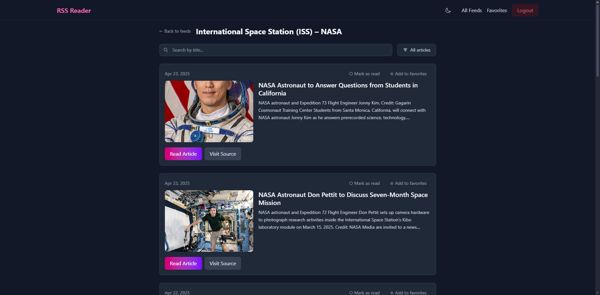

# RSS Reader

A modern RSS reader application built with Next.js, React, and MongoDB.


## Demo

Check out the live demo: [RSS Reader](https://rss-feed-reader-beta.vercel.app)

## Features

- **Feed Management**: Add, organize, and categorize your RSS feeds
- **Article Reading**: Clean, distraction-free reading experience for your subscribed content
- **Content Processing**: Intelligent parsing of various feed formats (RSS, Atom, XML)
- **Search**: Full-text search across all your articles
- **Favorites**: Save articles to read later
- **Read Status Tracking**: Keep track of what you've read
- **Responsive Design**: Optimized for desktop and mobile devices

## Tech Stack

- **Frontend**: Next.js 15, React 19, TailwindCSS 4, Framer Motion
- **Backend**: Next.js API Routes with App Router
- **Database**: MongoDB
- **Authentication**: JWT with bcrypt
- **State Management**: React Query (TanStack Query)
- **Content Processing**: RSS Parser, JSDOM, HTML-to-text, TurnDown

## Screenshots

<div align="center">
  
  <p><em>Dashboard view showing feed management</em></p>
  
  
  <p><em>Article reading experience</em></p>
  
  
  <p><em>Mobile responsive design</em></p>
</div>

## Getting Started

### Prerequisites

- Node.js 18.17+ and npm/yarn/pnpm/bun
- MongoDB (local or remote)

### Installation

1. Clone the repository
```bash
git clone https://github.com/Repith/rss-feed-reader
cd rss-reader
```

2. Install dependencies
```bash
npm install
# or
yarn
# or
pnpm install
# or
bun install
```

3. Set up environment variables
Create a `.env.local` file in the root directory with the following variables:
```
MONGODB_URI=your_mongodb_connection_string
JWT_SECRET=your_jwt_secret
```

4. Start the development server
```bash
npm run dev
# or
yarn dev
# or
pnpm dev
# or
bun dev
```

5. Open [http://localhost:3000](http://localhost:3000) with your browser to see the application.

### Using Docker

The project includes Docker configuration for MongoDB:

```bash
docker-compose up -d
```

This will start a MongoDB instance with the following credentials:
- Username: admin
- Password: password
- Port: 27017

## Development

### Project Structure

```
rss-reader/
├── app/                  # Next.js App Router pages and API routes
│   ├── api/              # API endpoints
│   ├── dashboard/        # Dashboard pages
│   ├── login/            # Authentication pages
│   └── ...
├── src/
│   ├── application/      # Application services
│   ├── components/       # Reusable React components
│   ├── domain/           # Domain models and repository interfaces
│   ├── infrastructure/   # Repository implementations
│   └── lib/              # Utility functions and shared code
├── public/               # Static assets
└── ...
```

### Key Features Implementation

#### Feed Parsing

The application supports multiple feed formats:
- Standard RSS
- Atom feeds
- Generic XML with fallback parsing
- HTML content extraction when feed format is not recognized

#### Content Processing

Articles are processed to:
- Sanitize HTML content
- Extract plain text for snippets
- Find featured images
- Convert to readable format

### Available Scripts

- `npm run dev`: Start the development server with Turbopack
- `npm run build`: Build the application for production
- `npm run start`: Start the production server
- `npm run lint`: Run ESLint to check code quality

## API Endpoints

- `GET /api/feeds`: Get all feeds for the authenticated user
- `POST /api/feeds`: Add a new feed
- `GET /api/feeds/:id/articles`: Get articles for a specific feed
- `POST /api/articles/read`: Mark an article as read/unread
- `POST /api/articles/favorite`: Mark an article as favorite/unfavorite
- `GET /api/articles/search`: Search articles

## Contributing

Contributions are welcome! Please feel free to submit a Pull Request.

## License

This project is licensed under the MIT License - see the LICENSE file for details.

## Acknowledgments

- [RSS Parser](https://github.com/rbren/rss-parser) for feed parsing
- [JSDOM](https://github.com/jsdom/jsdom) for HTML processing
- [TailwindCSS](https://tailwindcss.com/) for styling
- [Framer Motion](https://www.framer.com/motion/) for animations


